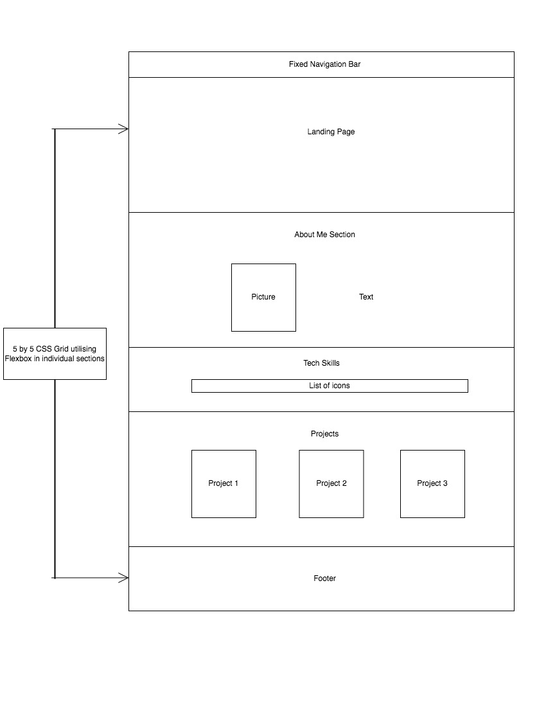

# Portfolio (WIP)

A single-page responsive portfolio showcasing my most recent projects, each with a brief description. This website design strives to display on multiple devices and screen sizes, great and small.

## Live Site

https://amx3.github.io/Personal-Portfolio/

## Aim

Aspiring junior developer with a keen interest in technology and web development. I am currently a full-time student in the \_nology Tech Consultancy programme, where I am learning new concepts in a variety of programming languages, frameworks, and tools.

My portfolio aims to engage my audience through a combination of clear, defined design, subtle effects, and project-specific purpose.

## Goals

Interested in front-end development, my end-goal is to utilise my educational background, experience and new software development skills to apply to real-life applications and websites within a collaborative environment.

## Tech Stack Used

-   HTML
-   CSS/ SCSS
-   JavaScript
-   Github/ Git

## Design Implementation Process

The foundations of my portfolio are created using Flexbox & CSS Grid. Fontawesome icons were used.

## Portfolio Screenshots
